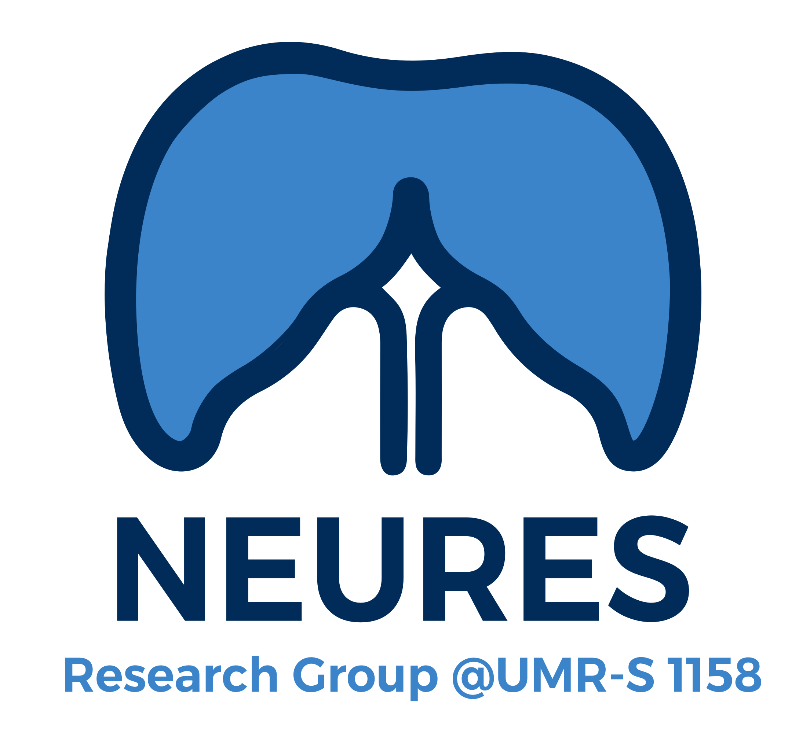

## Hi there 👋
I am a tenured research scientist at the French National Institute of Health and Medical Research (INSERM). My work lies at the intersection of skeletal muscle (respiratory and locomotor) physiology, biomedical engineering and rehabilitation sciences. My research combines fundamental physiology with technological innovation to develop new diagnostic and therapeutic solutions for neuromuscular impairments. Methodological and technological advancements play a central role in my work, particularly with regard to the characterisation of neuromuscular structure and function.

In our lab, we leverage cutting-edge techniques ssuch as ultrafast ultrasound and molecular imaging, physiological measurements and artificial neurostimulation, as well as computational modelling and tissue-based analysis.

Beyond research, I am actively engaged in the valorization of scientific innovation for public health, translating research into real-world impact. I am also committed to data science, reproducible research, and training of young scientists.

Feel free to get in touch regarding any of my interests.

    
    
I lead the <a href="https://github.com/Neures-1158">NEURES</a> research group hosted at the <a href="https://sante.sorbonne-universite.fr/structures-de-recherche/neurophysiologie-respiratoire-experimentale-et-clinique">1158 joint resarch unit</a> Inserm-Sorbonne Université).

 

---

## Selected projects
- [NEURES-1158](https://github.com/Neures-1158) – Organization repositories of my research group
- [lachart_txt_parser](https://github.com/dambach/lachart_txt_parser) - Python package for parsing .txt exported labchart files 
- [resp_metrics](https://github.com/dambach/resp_metrics) - Python package to compute ventilatory variables and mechanical ventilation metrics

<!--
**dambach/dambach** is a ✨ _special_ ✨ repository because its `README.md` (this file) appears on your GitHub profile.

Here are some ideas to get you started:

- 🔭 I’m currently working on ...
- 🌱 I’m currently learning ...
- 👯 I’m looking to collaborate on ...
- 🤔 I’m looking for help with ...
- 💬 Ask me about ...
- 📫 How to reach me: ...
- 😄 Pronouns: ...
- ⚡ Fun fact: ...
-->
