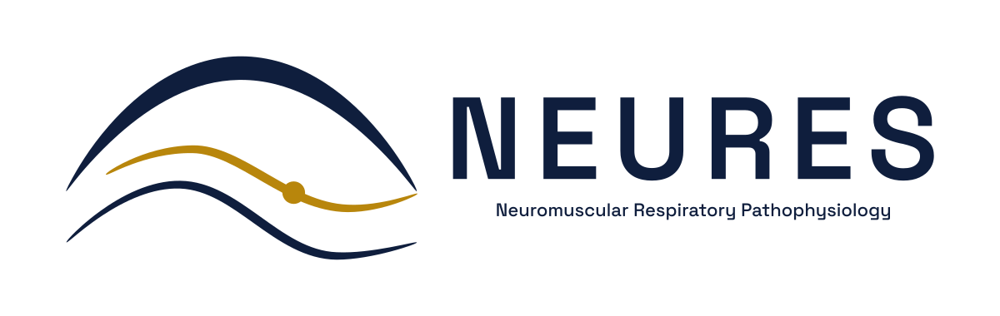

## Hi there 👋

I am a senior researcher at Inserm (French National Institute of Health and Medical Research) in Paris. I study skeletal muscle physiology, respiratory and locomotor, at the interface with biomedical engineering and rehabilitation sciences. I develop methods to measure muscle structure and function, such as ultrafast ultrasound, shear wave elastography, molecular imaging, electrophysiology and neurostimulation, and turn them into diagnostic tools and treatments for neuromuscular impairment.

I lead the [NEURES](https://github.com/Neures-1158) research group (Neuromuscular Respiratory Pathophysiology) in the joint research unit [UMR-S 1158](https://sante.sorbonne-universite.fr/structures-de-recherche/neurophysiologie-respiratoire-experimentale-et-clinique) (Inserm, Sorbonne Université). I am also building DIAV+, a medical device for continuous, non-invasive monitoring of inspiratory effort during mechanical ventilation.

I care about data science, reproducible research and training young scientists.

Contact: [damien.bachasson@inserm.fr](mailto:damien.bachasson@inserm.fr)

---

## Selected projects

- [NEURES](https://github.com/Neures-1158): repositories of my research group
- [labchart_txt_parser](https://github.com/Neures-1158/labchart_txt_parser): Python package to parse LabChart text exports
- [resp_metrics](https://github.com/Neures-1158/resp_metrics): Python package to compute ventilatory and mechanical ventilation variables from LabChart exports
- [app_strength-Harbo](https://github.com/dambach/app_strength-Harbo): Shiny app computing predicted maximal isometric and isokinetic strength in major muscle groups ([online version](https://damienbachasson.shinyapps.io/app_strength-Harbo/))
